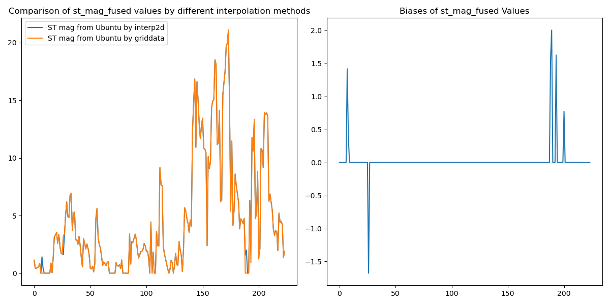

# Waveutils

The package is designed for SWIM and SAR data fusion to get a ambiguity-removed wave spectrum and calculate the Stokes drift in the given depths. Two main methods were implemented: 
1. SAR SWIM fusion,
2. Wind-based ambiguity removal (Used in SWIM L2P Stokes drift product).

# Platform and Interpolation Dependencies

This package performs numerical computations that may yield slightly different results across different operating systems and when using different interpolation methods (such as `scipy.interpolate.interp2d`(removed in the newest version) vs `scipy.interpolate.griddata`). These differences are typically minimal, as verified through testing on **Ubuntu 22.04.2** and **macOS 15.0.1**.
This package performs numerical computations that may produce slightly different results on different platforms and with different interpolation methods such as interp2d and griddata provided by scipy. The number of differences is typically small, as tested in **Ubuntu 22.04.2** and **macOS 15.0.1** comparing between the interp2d and griddata methods. 

Below are visualization of the platform- and interpolation-dependent results:

*Figure 1: Comparison between Stokes drift magnitude estimated across **Ubuntu** and **macOS** systems.*

*Figure 2: Comparison between Stokes drift magnitude estimated by **interp2d** and **griddata** methods.*

**Reasons**
These biases should come from the sensitivity of the partitioning algorithms, in our case, the partitioning algorithm used for partitioning the SAR wave spectra.
